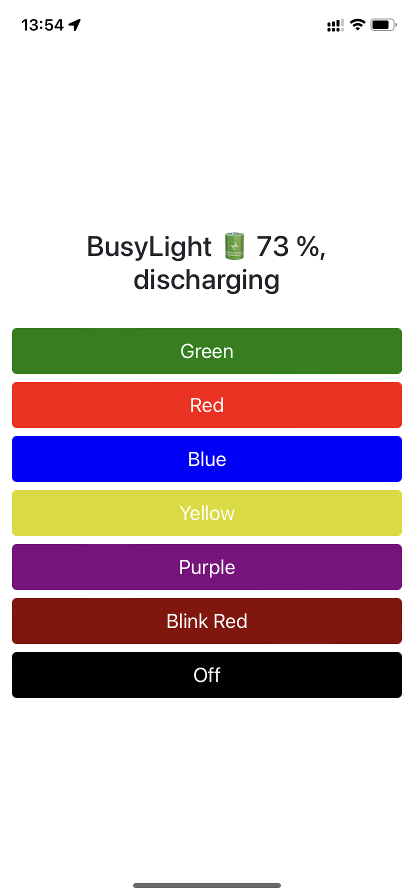

# Busylight

Flask web app to control the [Plantronics Status Indicator](https://www.poly.com/us/en/products/headsets/accessories/status-indicator) on my desk using [busylight](https://github.com/JnyJny/busylight)

## Demo

## WebApp

